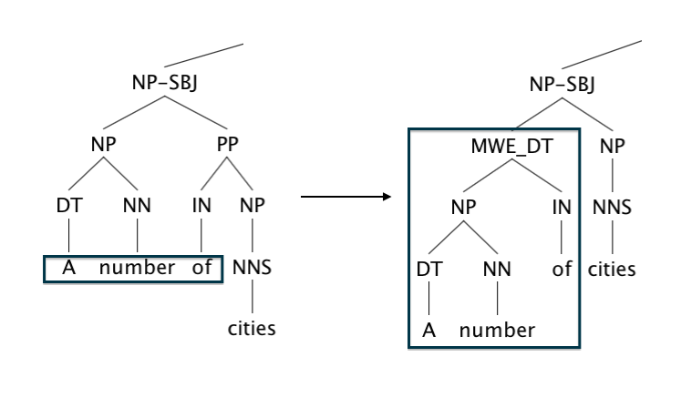
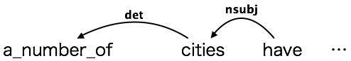
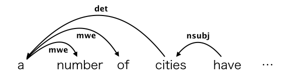

# MWE-aware Dependency Corpus

We provide users with an English dependency corpus taking into account compound function words, which are one type of multiword expressions (MWEs) and serve as functional expressions.

We built the corpus according to the following method.

  1. We found an MWE in the phrase structure trees of Ontonotes and establish it as a single subtree.

   - We utilized the information (position in sentence and part of speech) of MWEs provided by [1].

   - The phrase structure trees made by this step is also provided.

   

  2. We replaced the above subtree by a preterminal with its leaf node as a child. The preterminal has the same part of speech as that of the MWE. Its child node is made by joining all components of the MWE with underscores.

  3. We converted the phrase structure into Stanford Dependency [2].
       - We designated "-conllx -basic -makeCopulaHead -keepPunct" as a option for the conversion command.
       - We show an example of MWE-aware Dependency here.

        

  <br>
  4. We decomposed  the token derived from MWE (e.g. a_number_of) to ``head-initial'' dependency structure taking into account the consistency with Universal Dependency [3]. In other words, each token of MWE modifies the first one using the mwe label.

  


MWE-aware Dependency and associated documentation can be downloaded from: <https://github.com/naist-cl-parsing/mwe-aware-dependency>

## Files

### dependency
#### ontonotes_wsj_00_24_mwe_aware.conll
- MWE-aware Dependency for Section 00-24 of Wall Street Journal in Ontonotes (Stanford Dependency).

### phrase-structure
#### ontonotes_wsj_00_24_mwe_aware.patch
- Patch for creating Treebank incorporating MWEs (Section 00-24 of Wall Street Journal in Ontonotes)

- We checked this patch on the following environment:
 - Ubuntu Linux 12.04.2 LTS
 - Python 2.7.3
 - nltk 3.0.4
     - Please follow the instructions for installing NLTK at http://nltk.org/install.html .

#### normalize_indentation.py
- Script to make an indentation of S-expression same as that we get if we could call print() for nltk.tree.Tree instance (This is a preparation for applying the above patch)

## .conll Format
1 token per line, with blank lines separating sentences.

14 tab-separated columns (columns 1-10 are based on CoNLL-X Format [4]):

1.  ID
2.  FORM  (replaced by underscore for licensing restrictions)
3.  LEMMA (replaced by underscore for licensing restrictions)
4.  CPOSTAG (filled by underscore)
5.  POSTAG
6.  FEATS (filled by underscore)
7.  HEAD
8.  DEPREL
9.  PHEAD (filled by underscore)
10. PDEPREL (filled by underscore)
11. Filename in Ontonotes (e.g. wsj_0001)
12. Head in MWE_aware dependency (for MWEs, we adopt "head-initial" structure.)
13. Dependency label in MWE_aware dependency (we use "mwe" label for each token of MWE excluding the first token)
14. Part-of-speech tag of MWE (only for the first token of each MWE)

## Application of patch

In order to apply the above patch, you need the Ontonotes release-5.0 (LDC2013T19). If you move to a folder just above Wall Street Journal in Ontonotes directory, it looks like this:

```$ ls LDC2013T19/ontonotes-release-5.0/data/files/data/english/annotations/nw/wsj```

    00  02  04  06  08  10  12  14  16  18  20  22  24  
    01  03  05  07  09  11  13  15  17  19  21  23

First, make directory for our corpus.

```$ mkdir -p ontonotes_5.0_mwe_aware_v1.0/wsj```

In order to normalize the indentation style, do the following command:

```$ python normalize_indentation.py LDC2013T19/ontonotes-release-5.0/data/files/data/english/annotations/nw/wsj ontonotes_5.0_mwe_aware_v1.0/wsj```

Then, apply the patch.

```$ patch -p1 -d ontonotes_5.0_mwe_aware_v1.0/wsj < /.../mwe_aware_dependency/phrase_structure/ontonotes_wsj_00_24_mwe_aware.patch```

## References
- [1] Yutaro Shigeto, Ai Azuma, Sorami Hisamoto, Shuhei Kondo, Tomoya Kouse, Keisuke Sakaguchi, Akifumi Yoshimoto, Frances Yung, Yuji Matsumoto. 2013. Construction of English MWE Dictionary and its Application to POS Tagging. Proceedings of the 9th Workshop on Multiword Expressions, pages 139–144, Atlanta, Georgia, USA. Association for Computational Linguistics.
(http://www.aclweb.org/anthology/W13-1021)

- [2] Marie-Catherine de Marneffe, Christopher D. Manning. 2008. The Stanford Typed Dependencies Representation. Coling 2008: Proceedings of the workshop on Cross-Framework and Cross-Domain Parser Evaluation, pages 1–8, Manchester, UK. Coling 2008 Organizing Committee.
(http://www.aclweb.org/anthology/W08-1301)

- [3] Ryan Mcdonald, Joakim Nivre, Yvonne Quirmbach- brundage, Yoav Goldberg, Dipanjan Das, Kuzman Ganchev, Keith Hall, Slav Petrov, Hao Zhang, Oscar Ta ̈ckstro ̈m, Claudia Bedini, Nu ́ria Bertomeu Castello ́, and Jungmee Lee. 2013. Universal Dependency Annotation for Multilingual Parsing. Proceedings of the 51st Annual Meeting of the Association for Computational Linguistics, pages 92–97.
(https://aclweb.org/anthology/P/P13/P13-2017.pdf)

- [4] CoNLL-X Shared Task: Multi-lingual Dependency Parsing
(http://ilk.uvt.nl/conll/)

## History
  - MWE-aware Dependency 1.0: 2015-10-15.

## Contact
- Please e-mail kato.akihiko.ju6 /at/ is.naist.jp with questions.

## Contributors
- Akihiko Kato
- Hiroyuki Shindo
- Yuji Matsumoto
